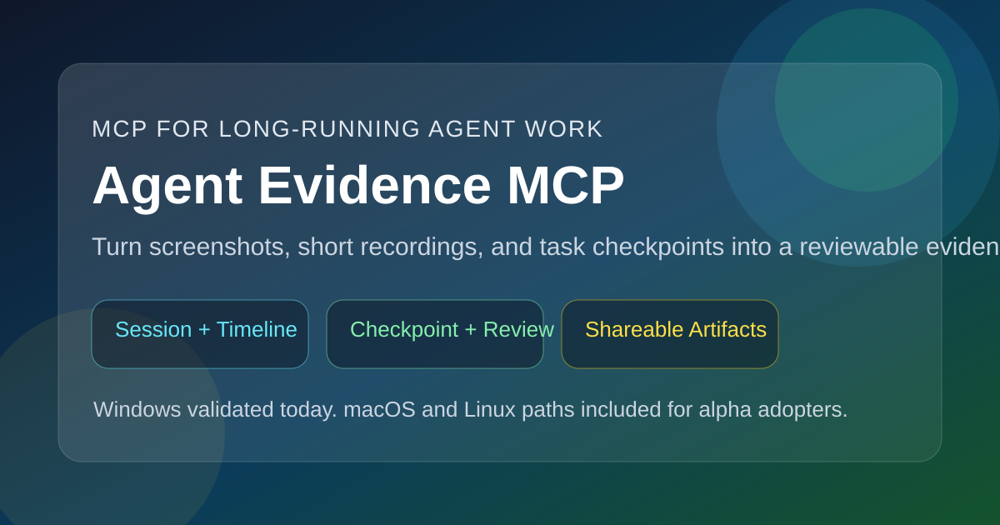

# Agent Evidence MCP

[](https://github.com/xiexie-qiuligao/agent-evidence-mcp/releases)
[](https://github.com/xiexie-qiuligao/agent-evidence-mcp/actions/workflows/ci.yml)
[](./LICENSE)



## 中文

让 agent 在执行长任务时，自动留下截图、短录屏、备注和最终总结。

Agent Evidence MCP 不是普通截图软件，也不是浏览器自动化框架。它更像一个本地证据记录器：当 agent 正在操作浏览器、桌面软件、后台系统或多步骤流程时，它把关键状态保存成可复盘的任务记录。

### 适合什么场景

- agent 正在执行多步骤 UI、QA、运维、配置或排障任务
- 你希望关键节点自动留图，失败或异常时额外留证据
- 任务结束后需要 `summary.md`、`timeline.jsonl` 和所有关键产物路径
- 你想让同事、客户或之后的自己快速复盘 agent 做过什么

### 装上之后能做什么

- 创建任务会话：`start_session`
- 查看已有会话：`list_sessions` / `get_session` / `get_latest_session`
- 保存里程碑截图：`capture_checkpoint`
- 必要时录一小段屏幕：`start_recording` / `stop_recording`
- 给证据加备注或 OCR 文本：`attach_note` / `ocr_artifact`
- 生成可分享的打码副本：`redact_artifact`
- 比较最近的证据变化：`compare_artifacts` / `compare_latest_artifacts`
- 结束时生成可交付的任务记录：`end_session`
- 通过 MCP resources 读取最新 summary、artifact 列表和 session 索引
- 通过 MCP prompts 获取推荐的证据采集和最终复盘提示

### 推荐用法

这个项目最适合配合 agent 使用。通常只需要这样告诉 agent：

```text
Use agent-evidence MCP for this task.
Start a session first.
Capture a screenshot at each major milestone and an extra one on errors.
Prefer screenshots over recording unless motion matters.
When the task is done, give me the summary and the key artifact paths.
```

### 3 步上手

1. 安装

```bash
pip install -e .
```

2. 初始化配置

```bash
agent-evidence-mcp init
```

3. 启动 MCP 服务

```bash
agent-evidence-mcp serve
```

### 命令行快速体验

创建一个 session：

```bash
agent-evidence-mcp start-session "Admin QA Flow"
```

截一张关键节点图：

```bash
agent-evidence-mcp capture-checkpoint "D:\path\to\session" "form-submitted" "The form was submitted successfully."
```

结束并生成总结：

```bash
agent-evidence-mcp end-session "D:\path\to\session"
```

### 输出结构

```text
artifacts/
  <session_id>/
    session.json
    timeline.jsonl
    summary.md
    details/
    screenshots/
    recordings/
```

最终拿到的不是一堆散乱截图，而是一套带时间线、摘要和元数据的任务证据包。

### 平台支持

| 能力 | Windows | macOS | Linux |
| --- | --- | --- | --- |
| Session / MCP / CLI | 已实现并本地验证 | 已实现 | 已实现 |
| 截图 | 已实现并本地验证 | 已实现，尚未在本仓库实机验证 | 已实现，依赖本地截图工具 |
| 录屏 | 已实现并本地验证 | 已实现，尚未在本仓库实机验证 | 已实现，依赖 X11/ffmpeg 环境 |
| Redaction | 已实现并本地验证 | 暂未实现 | 暂未实现 |

更详细的说明见 [support-matrix.md](docs/support-matrix.md)。

### 校验下载文件

release 页面会附带 `SHA256SUMS.txt`。如果你下载了 wheel 或源码包，可以这样校验：

```bash
certutil -hashfile dist\\agent_evidence_mcp-0.1.0a1-py3-none-any.whl SHA256
certutil -hashfile dist\\agent_evidence_mcp-0.1.0a1.tar.gz SHA256
```

### 文档

- [客户端配置](docs/client-configs.md)
- [Prompt 示例](docs/recipes.md)
- [支持矩阵](docs/support-matrix.md)
- [已知限制](docs/known-limitations.md)
- [架构说明](docs/architecture.md)
- [Examples 索引](examples/README.md)

---

## English

Let your agent leave behind screenshots, short recordings, notes, and a final summary while it works through a long-running task.

Agent Evidence MCP is not a generic screenshot app or a browser automation framework. It is a local evidence recorder for agent work: when an agent operates a browser, desktop app, admin console, or multi-step workflow, this server saves the important states as a reviewable task record.

### Good Fits

- multi-step UI, QA, ops, configuration, or troubleshooting tasks
- workflows where milestone screenshots and error evidence matter
- handoffs that need `summary.md`, `timeline.jsonl`, and artifact paths
- reviews where another person needs to understand what the agent did

### What You Get

- start a task session with `start_session`
- inspect existing sessions with `list_sessions`, `get_session`, and `get_latest_session`
- capture milestone screenshots with `capture_checkpoint`
- record short screen segments when motion matters
- attach notes or OCR text to artifacts
- generate redacted copies for safer sharing
- compare recent artifacts for review-oriented changes
- finish with `summary.md`, `timeline.jsonl`, and organized artifacts
- read the latest summary, artifact list, and session index through MCP resources
- use MCP prompts for evidence capture and final review guidance

### Best Way To Use It

This project is designed to work with an agent. In most cases you can simply tell the agent:

```text
Use agent-evidence MCP for this task.
Start a session first.
Capture a screenshot at each major milestone and an extra one on errors.
Prefer screenshots over recording unless motion matters.
When the task is done, give me the summary and the key artifact paths.
```

### Quick Start In 3 Steps

1. Install

```bash
pip install -e .
```

2. Initialize config

```bash
agent-evidence-mcp init
```

3. Start the MCP server

```bash
agent-evidence-mcp serve
```

### Try It From The CLI

Create a session:

```bash
agent-evidence-mcp start-session "Admin QA Flow"
```

Capture a milestone:

```bash
agent-evidence-mcp capture-checkpoint "D:\path\to\session" "form-submitted" "The form was submitted successfully."
```

End the session:

```bash
agent-evidence-mcp end-session "D:\path\to\session"
```

### What The Output Looks Like

```text
artifacts/
  <session_id>/
    session.json
    timeline.jsonl
    summary.md
    details/
    screenshots/
    recordings/
```

The result is not a pile of loose screenshots. It is a reviewable task evidence package with a timeline, summary, and artifact metadata.

### Platform Support

| Capability | Windows | macOS | Linux |
| --- | --- | --- | --- |
| Session / MCP / CLI | Implemented and locally validated | Implemented | Implemented |
| Screenshots | Implemented and locally validated | Implemented, not locally validated in this repo | Implemented, depends on local screenshot tools |
| Recording | Implemented and locally validated | Implemented, not locally validated in this repo | Implemented, depends on X11/ffmpeg setup |
| Redaction | Implemented and locally validated | Not implemented | Not implemented |

See [support-matrix.md](docs/support-matrix.md) for more detail.

### Verify Downloads

The release includes `SHA256SUMS.txt`. If you download the wheel or source archive, you can verify them like this:

```bash
certutil -hashfile dist\\agent_evidence_mcp-0.1.0a1-py3-none-any.whl SHA256
certutil -hashfile dist\\agent_evidence_mcp-0.1.0a1.tar.gz SHA256
```

### Docs

- [Client configs](docs/client-configs.md)
- [Prompt recipes](docs/recipes.md)
- [Support matrix](docs/support-matrix.md)
- [Known limitations](docs/known-limitations.md)
- [Architecture](docs/architecture.md)
- [Examples index](examples/README.md)
